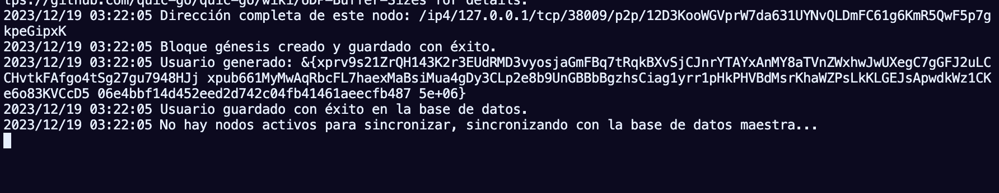
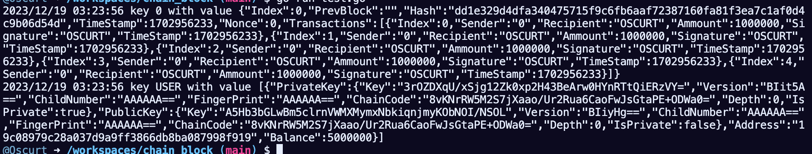
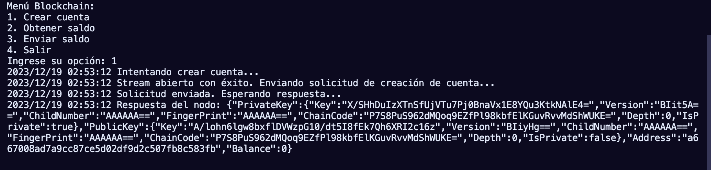

# chain_block

## Integrantes

- Cristian Villavicencio
- David Pazan
- Sebastian Gonzalez

## Descripción

Este repositorio contiene la implementación de un sistema de blockchain. El proyecto se estructura en varios módulos, cada uno con una funcionalidad específica para el funcionamiento integral del sistema de blockchain.

## Modulos

### database

Este módulo gestiona la conexión con la base de datos y proporciona métodos fundamentales como get, put, delete, así como la inicialización y cierre de la conexión. Se utiliza LevelDB para el almacenamiento de datos.

### common

Contiene las estructuras de datos utilizadas en el proyecto, así como funciones auxiliares que facilitan el desarrollo y la operatividad del sistema.

### core

Aquí se encuentra la lógica central del funcionamiento de bloques, transacciones y usuarios. Este módulo gestiona la creación de nuevos elementos y coordina la comunicación con el módulo de red para la sincronización con la blockchain.

### network

Implementa la red utilizando la biblioteca libp2p y el protocolo Kademlia DHT. Este módulo maneja la conexión entre nodos a través de nodos semilla y realiza la sincronización de datos en la red. Se utilizan variables de entorno para gestionar dinámicamente los nodos disponibles.

### Ejecutar

Para interactuar con la red blockchain, se deben seguir los siguientes pasos:

- Ejecución de Nodos: Se pueden ejecutar varios nodos, con un límite de 20 nodos semilla. Estos nodos se conectarán y sincronizarán automáticamente. La primera creación de un nodo en una red nueva generará la base de datos maestra, y cada nodo mantendrá su propia base de datos local. Para ejecutar un nodo, use el comando:

```bash
go run node.go
```

- Ejecución del Cliente: Para interactuar con la red, se debe ejecutar client.go. Es necesario que exista al menos un nodo en ejecución; de lo contrario, el cliente terminará su ejecución. El cliente se conectará aleatoriamente con uno de los nodos activos para interactuar con la red. Cada acción realizada se refleja en toda la red a través de la sincronización automática. Para ejecutar el cliente, use el comando:

```bash
go run client.go
```

### Pruebas de funcionamiento

#### Bloque genesis:




#### Crear cuenta nueva





#### Envio saldo


#### Saldo insuficiente


#### Saldo a cuenta inexistente


#### Consulta de saldo


